# NewsPortal Frontend

A modern Persian news platform frontend built with **React 19 and Vite**, designed to work with the NewsPortal RESTful backend API.

The frontend provides the user interface for browsing news, authentication, user accounts, news submission, bookmarks, notifications, and administrative content management.

## 📌 Project Overview

NewsPortal Frontend is the client-side application of the NewsPortal full-stack project.

The application communicates with the NewsPortal ASP.NET Core Web API through RESTful APIs and provides separate experiences for regular users and administrators.

### Main Capabilities

* News browsing and article details
* User registration and login
* JWT-based authentication
* Email verification
* Password reset flow
* User profile management
* News submission
* Pending review workflow
* Bookmarks
* Notifications
* Categories, cities, and tags
* Comments and reactions
* Administrative dashboard
* News management
* Category, city, and tag management
* Comment moderation
* User management
* Responsive Persian RTL interface

## 🛠️ Tech Stack

### Frontend

* React 19
* Vite
* JavaScript (ES Modules)
* React Router
* Axios
* HTML5
* CSS

### Development Tools

* Vite
* Oxlint
* Git
* GitHub

### Backend Integration

* ASP.NET Core Web API
* .NET 9
* RESTful APIs
* JWT Authentication

## 🏗️ Application Structure

The frontend is organized around reusable components, pages, API modules, authentication state, and protected routes.

```text
src/
│
├── api/
│   ├── client.js
│   ├── authApi.js
│   ├── newsApi.js
│   ├── profileApi.js
│   ├── passwordResetApi.js
│   ├── emailVerificationApi.js
│   └── ...
│
├── components/
│   ├── Layout
│   ├── ProtectedRoute
│   ├── AdminRoute
│   └── reusable UI components
│
├── context/
│   └── AuthContext.jsx
│
├── pages/
│   ├── Home
│   ├── NewsDetail
│   ├── Login
│   ├── Register
│   ├── Account
│   ├── ForgotPassword
│   ├── ResetPassword
│   ├── VerifyEmail
│   ├── NewsSubmit
│   ├── MyBookmarks
│   ├── Notifications
│   └── admin/
│
├── App.jsx
└── main.jsx
```

## 🔐 Authentication & Authorization

The frontend integrates with the backend authentication system using JWT access tokens.

### Authentication Features

* User registration
* User login
* JWT access token handling
* Logout
* Email verification
* Password reset
* Authentication state management
* Automatic handling of expired authentication sessions

### Login & Registration

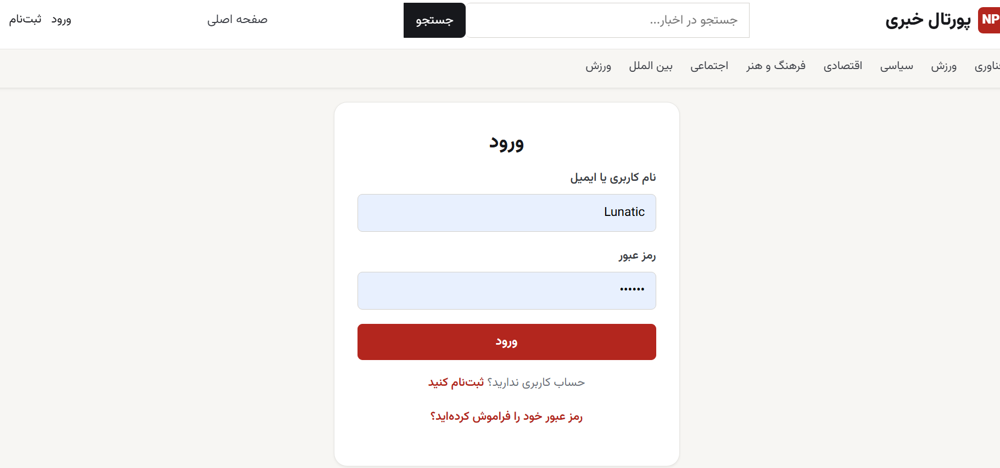

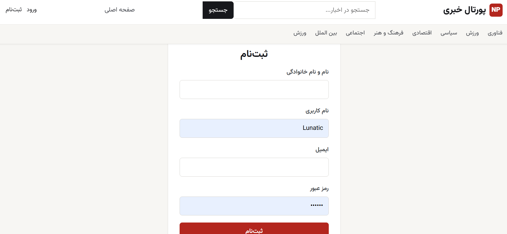

### Protected Routes

Authenticated user pages are protected through a dedicated `ProtectedRoute` component.

Examples include:

* Account
* News submission
* Bookmarks
* Notifications

Administrative pages use a separate `AdminRoute` to provide an additional client-side role check before displaying the admin interface.

> Frontend route protection is used for navigation and user experience. Final authorization and access control are enforced by the backend API.

## 📰 News Features

The frontend provides the main user-facing news functionality.

### Public News

Users can:

* Browse published news
* View news details
* Navigate by categories
* Explore news based on different classifications
* View featured, popular, and related content

### Home Page

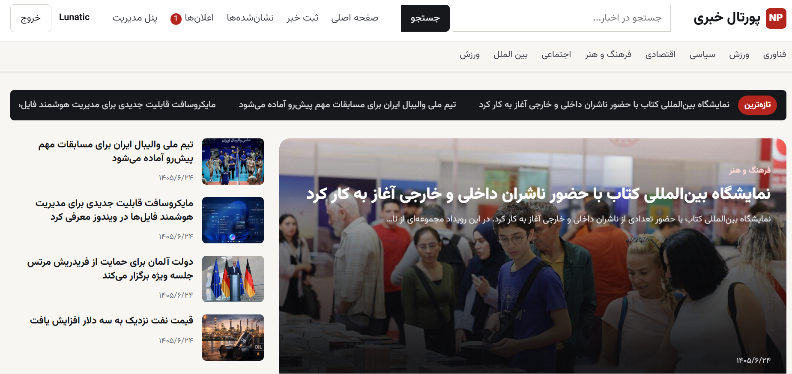

The latest news grid with the most viewed sidebar:

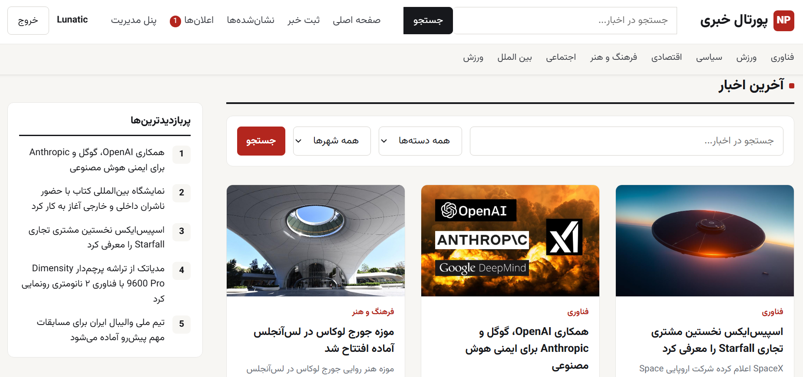

Filtering news by category, city, or keyword:

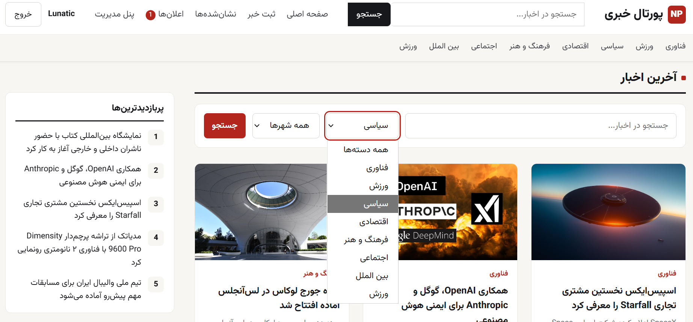

### News Details

Each article shows its category, author, publish and update dates, share and bookmark actions, and the main image.

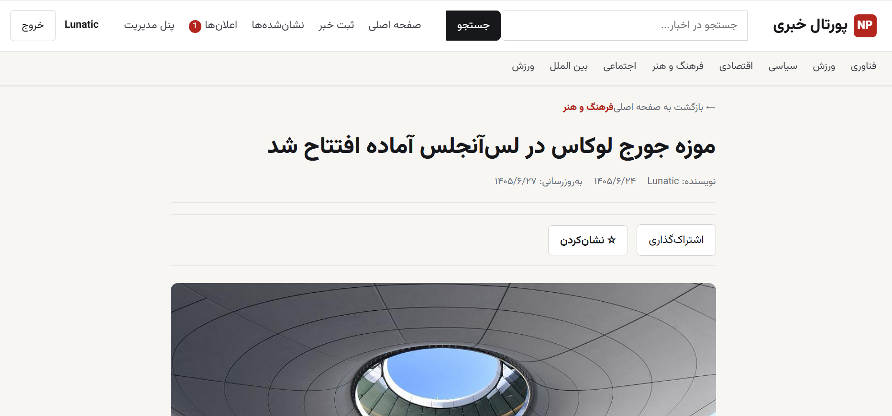

Articles can include an image gallery, tags, like and dislike reactions, and a related news section. Bookmarked articles are highlighted for the signed-in user.

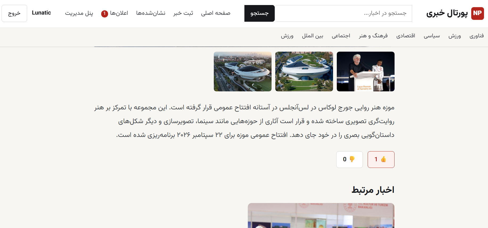

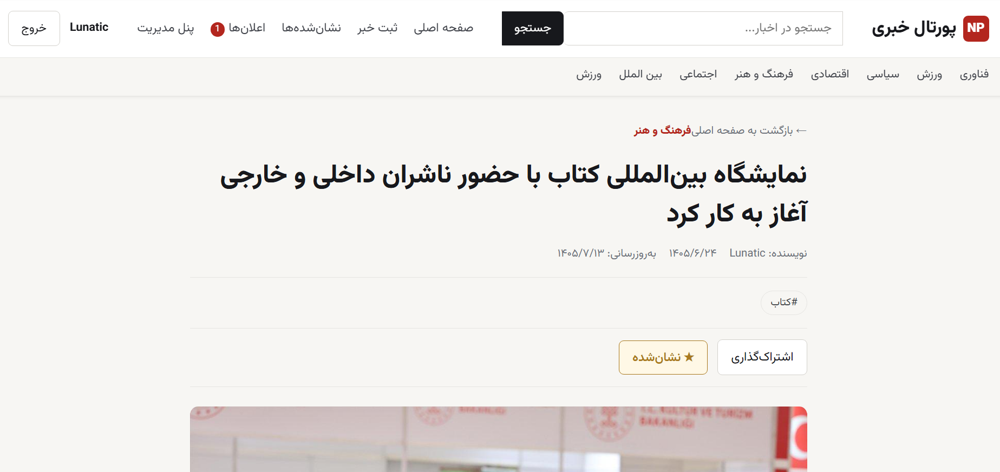

### Comments

Authenticated users can read and submit comments on each article.

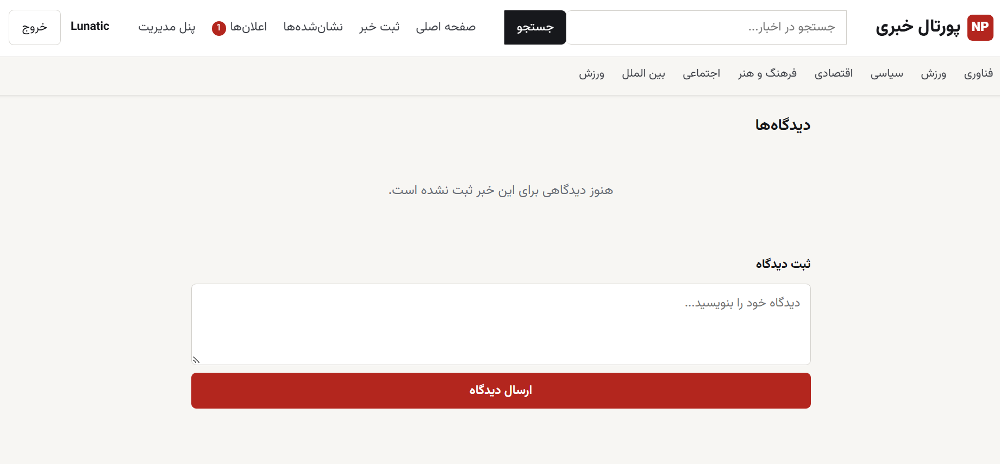

### News Submission

Authenticated users can submit news through the frontend.

The application supports the backend publication workflow:

```text
User submits news
       ↓
PendingReview
       ↓
Administrator review
       ↓
Published
```

This allows regular users to contribute content while administrators maintain control over publication.

## 👤 User Account

Authenticated users can access their personal account and manage profile-related information.

Available functionality includes:

* View profile information
* Update profile information
* Change password
* Manage personal content
* Access bookmarks
* View notifications

## 🔔 Notifications

The frontend integrates with the backend notification system.

Users can:

* View notifications
* View unread notification count
* Mark individual notifications as read
* Mark all notifications as read

## 🔖 Bookmarks

Authenticated users can save news articles for later access.

The frontend provides a dedicated bookmarks page for managing saved articles.

## 🛡️ Admin Panel

The frontend includes a dedicated administrative interface for users with the Admin role.

### Admin Features

* Dashboard
* News management
* Create and edit news
* Categories management
* Cities management
* Tags management
* Comment moderation
* User management

Administrative routes are separated from regular user routes and protected through the frontend routing layer.

The backend remains responsible for enforcing the actual authorization rules.

### Admin Panel Screenshots

News management with publication status control (Draft, Pending Review, Published, Rejected):

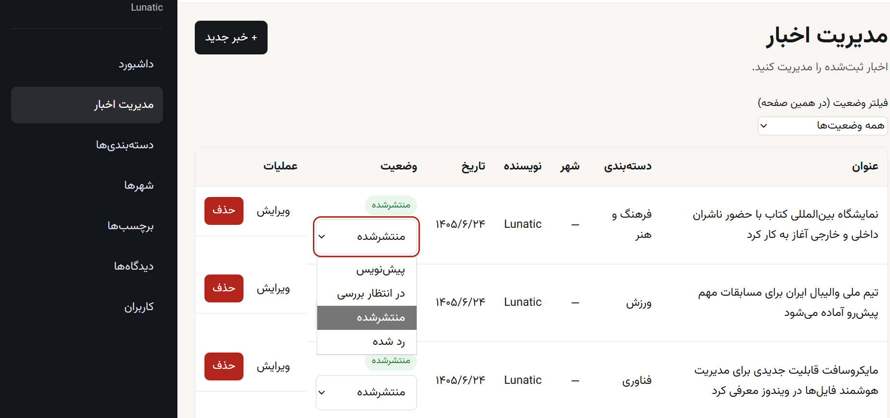

Creating and editing news:

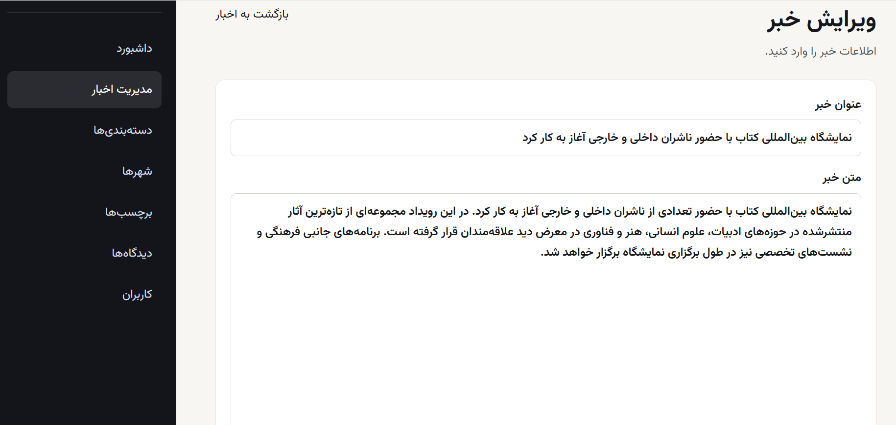

Category, tag, and city selection with multiple image upload:

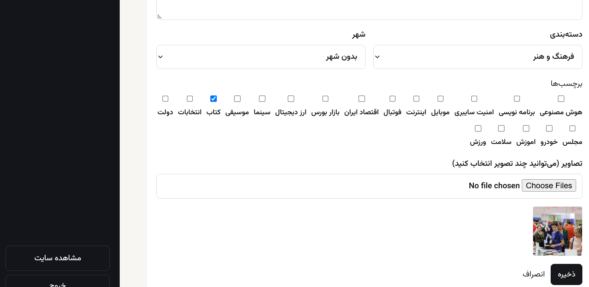

Category management:

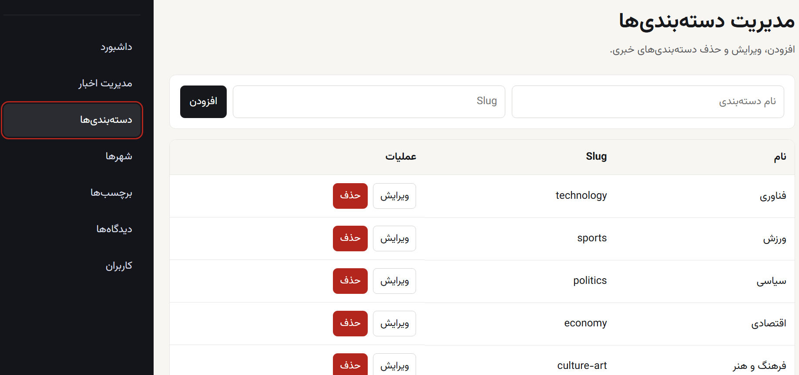

User and role management:

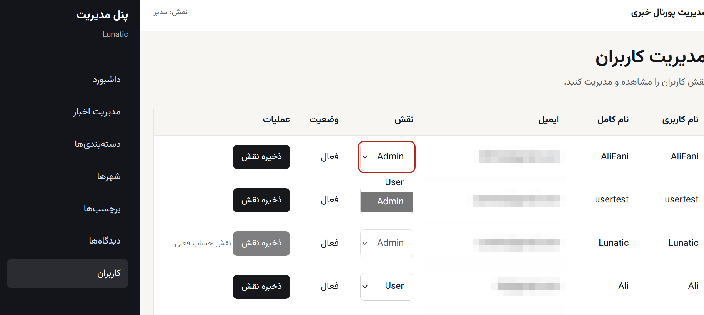

## 📡 API Communication

API communication is centralized through Axios.

The frontend uses a shared API client to:

* Configure the backend base URL
* Send HTTP requests
* Attach the JWT access token to authenticated requests
* Handle authentication expiration
* Keep API communication consistent across application modules

Example API flow:

```text
React Component
      ↓
API Module
      ↓
Axios API Client
      ↓
ASP.NET Core Web API
      ↓
Application / Domain / Infrastructure
      ↓
SQL Server
```

## ⚙️ Configuration

The API base URL can be configured through the Vite environment system.

Example:

```env
VITE_API_BASE_URL=https://localhost:7285/api
```

Environment files containing local configuration should not be committed to source control.

The repository includes a `.gitignore` configuration for environment files and other local development artifacts.

## 🚀 Getting Started

### Prerequisites

Make sure the following are installed:

* Node.js
* npm
* Git
* NewsPortal Backend

### Installation

Clone the repository:

```bash
git clone https://github.com/AliFani1382/newsportal-frontend.git
```

Navigate to the project directory:

```bash
cd newsportal-frontend
```

Install dependencies:

```bash
npm install
```

### Configure the Backend URL

Create a local environment file if required:

```env
VITE_API_BASE_URL=https://localhost:7285/api
```

Make sure the NewsPortal backend is running before using the application.

### Run Development Server

```bash
npm run dev
```

The Vite development server will start the application locally.

### Build for Production

```bash
npm run build
```

### Preview Production Build

```bash
npm run preview
```

### Lint

```bash
npm run lint
```

## 🔒 Security Considerations

The frontend follows several practices to avoid exposing sensitive configuration:

* Environment files are excluded from Git
* No API keys or backend secrets are stored in the frontend source code
* Authentication requests are handled through the centralized API client
* JWT authentication is integrated with protected application routes
* Administrative access is also enforced by the backend API
* Sensitive backend configuration remains outside the frontend repository

The frontend should not contain server-side secrets because values included in a browser application can ultimately be exposed to users.

## 📱 User Interface

The application is designed for a Persian news platform and uses a **right-to-left (RTL)** interface.

The UI includes dedicated layouts for:

* Public news pages
* Authentication pages
* User account pages
* News submission
* Notifications
* Bookmarks
* Administrative dashboard

### Mobile View

The interface is fully responsive and adapts to small screens with a collapsible navigation menu and a horizontally scrollable category bar.

<table>
  <tr>
    <td align="center">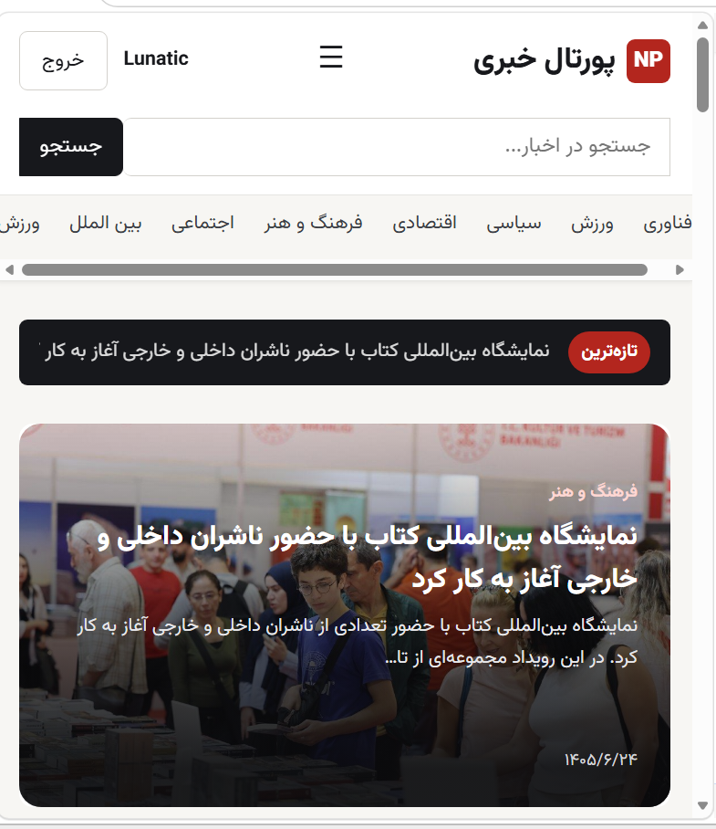<br><sub>Home</sub></td>
    <td align="center">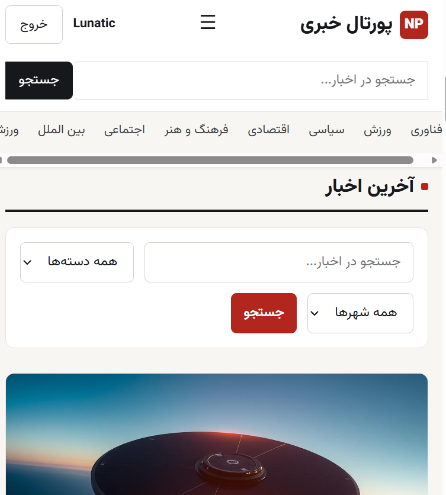<br><sub>Latest news & filters</sub></td>
    <td align="center">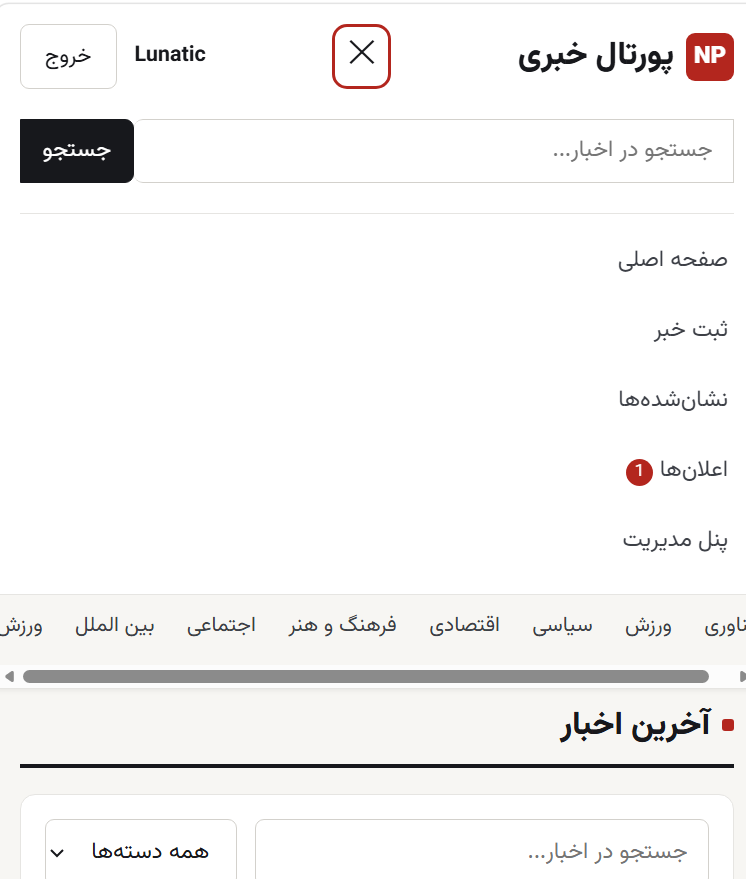<br><sub>Navigation menu</sub></td>
    <td align="center">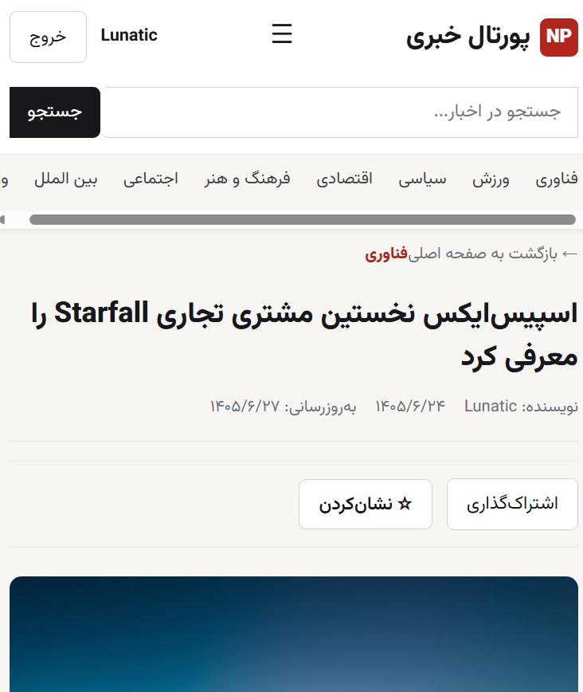<br><sub>News details</sub></td>
  </tr>
  <tr>
    <td align="center">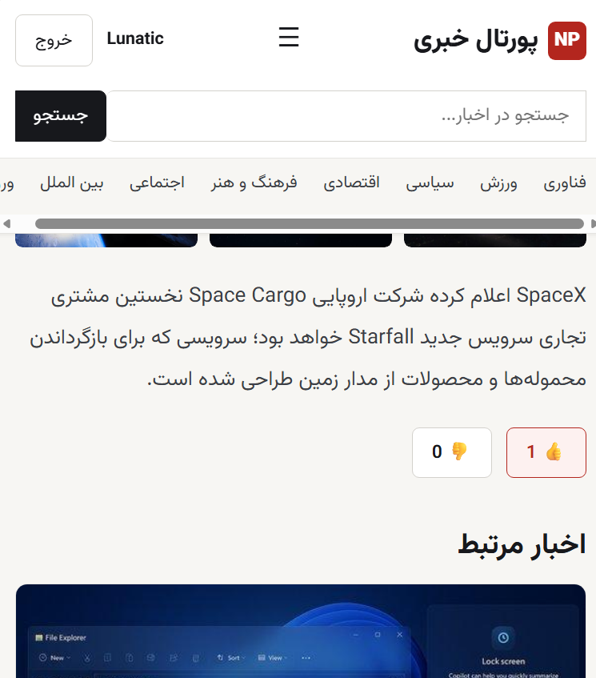<br><sub>Content & reactions</sub></td>
    <td align="center">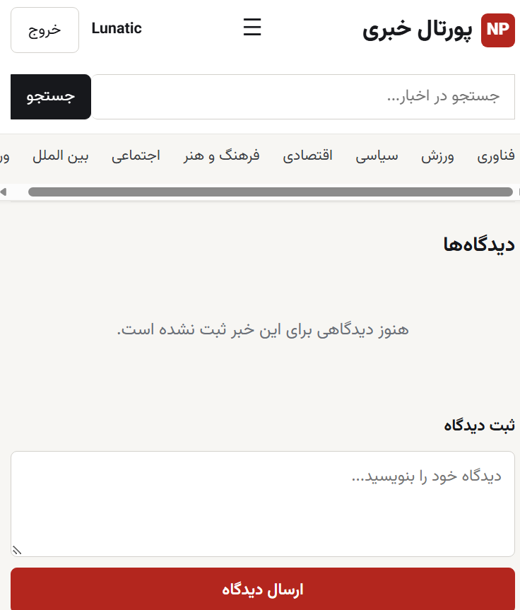<br><sub>Comments</sub></td>
    <td align="center">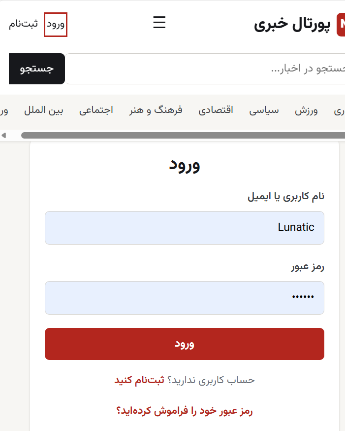<br><sub>Login</sub></td>
    <td align="center">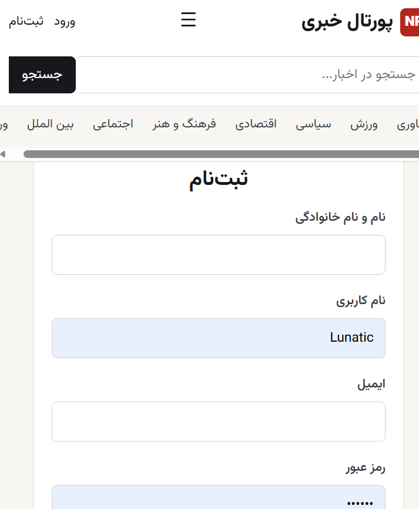<br><sub>Register</sub></td>
  </tr>
</table>

## 🔗 Related Repository

### Backend

The frontend communicates with the NewsPortal backend API:

https://github.com/AliFani1382/newsportal-backend

### Developer

GitHub profile:

https://github.com/AliFani1382

## 📊 Project Status

The NewsPortal frontend is currently complete and integrated with the NewsPortal backend.

The project was developed as a practical full-stack application with a focus on:

* React application development
* REST API integration
* Authentication and authorization
* Protected routing
* State management
* Reusable components
* Administrative interfaces
* User-facing news workflows
* API error and authentication handling
* Persian RTL user interface

## 🎯 Full-Stack Project

NewsPortal consists of two main repositories:

```text
NewsPortal
│
├── Frontend
│   └── React + Vite
│
└── Backend
    └── ASP.NET Core Web API + .NET 9
```

The frontend provides the user interface while the backend handles business logic, authentication, authorization, data persistence, and API services.

---

Built as a practical full-stack portfolio project using **React, ASP.NET Core, .NET 9, Entity Framework Core, and SQL Server**.
